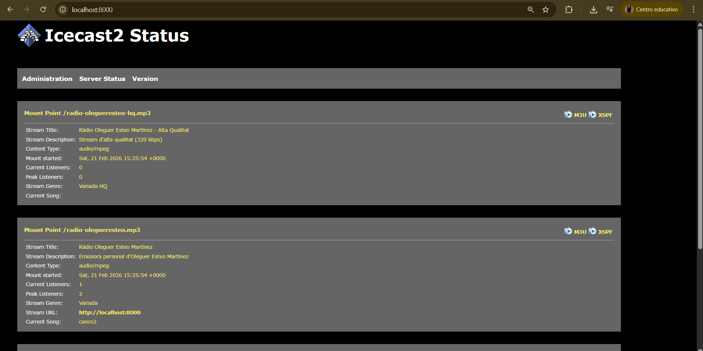
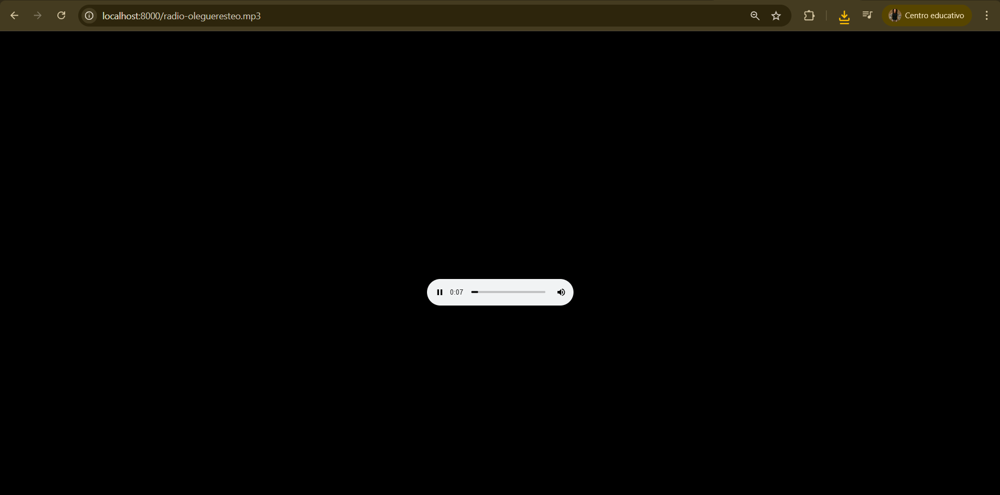
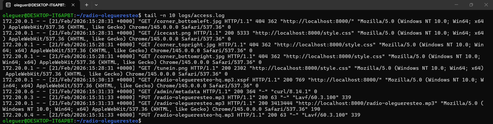

# 🎙️ Icecast Streaming Server amb Docker

Servidor de ràdio per Internet desplegat amb **Icecast i Docker Compose**, amb suport per múltiples formats (MP3 i Opus), playlist rotativa, metadades i programació horària.

---

## Requisits

* Docker Engine / Docker Desktop
* Docker Compose v2
* Navegador web modern
* VLC (opcional per proves)
* Fitxers MP3 lliures de drets

---

## Estructura del projecte

```
radio-olegueresteo/
│
├── docker-compose.yml
├── config/
│   ├── icecast.xml
│   ├── playlist.txt
│   ├── metadata.sh
│   ├── schedule.sh
│   └── crontab
│
├── audio/
│   ├── canco1.mp3
│   ├── canco2.mp3
│   └── playlist.txt
│
└── logs/
```

---

## Desplegament

### 1️⃣ Clonar el repositori

```bash
git clone https://github.com/USERNAME/radio-icecast-docker.git
cd radio-icecast-docker
```

### 2️⃣ Iniciar serveis

```bash
docker compose up -d
```

### 3️⃣ Verificar estat

```bash
docker compose ps
```

---

## Accés al servidor

### Exemple de reproducció en VLC



### Interfície web Icecast

```
http://localhost:8000
```

### Streams disponibles

* MP3 128 kbps

  ```
  http://localhost:8000/radio-olegueresteo.mp3
  ```

* MP3 320 kbps

  ```
  http://localhost:8000/radio-olegueresteo-hq.mp3
  ```

* Opus 96 kbps

  ```
  http://localhost:8000/radio-olegueresteo.opus
  ```

---

## Playlist rotativa

El streamer utilitza `ffmpeg` amb el format `concat` per reproduir tots els fitxers MP3 del directori `/audio` en bucle infinit.

### Generar playlist.txt

```bash
ls -1 audio/*.mp3 | sed "s|^audio/|file '/audio/|; s|$|'|" > audio/playlist.txt
```

Format del fitxer:

```
file '/audio/canco1.mp3'
file '/audio/canco2.mp3'
```

---

## Metadades (Títol de cançó)

El servei `metadata.sh` envia el nom de la cançó actual a Icecast utilitzant l’endpoint:

```
/admin/metadata?mode=updinfo
```

Les metadades es mostren a:

```
http://localhost:8000/status.xsl
```

---

## Programació horària

S’utilitza un contenidor amb `cron` per controlar els streamers:

| Hora  | Acció                   |
| ----- | ----------------------- |
| 08:00 | Inicia stream principal |
| 14:00 | Canvia a stream HQ      |
| 22:00 | Atura tots els streams  |

El contenidor accedeix al Docker socket per controlar els serveis.

---

## Monitorització

### Logs

```bash
cat logs/access.log
cat logs/error.log
```
### Monitorització en temps real



### Logs en temps real

```bash
docker compose logs -f
```

---

## Panell d’administració

```
http://localhost:8000/admin/
```

Credencials configurades a `icecast.xml`.

---

## 🛠 Tecnologies utilitzades

* Docker & Docker Compose
* Icecast
* FFmpeg
* Bash scripting
* Cron
* Linux networking

---

## Característiques implementades

* Multi-mount streaming
* MP3 i Opus
* Playlist automàtica
* Metadades dinàmiques
* Programació horària automàtica
* Logs i monitorització
* Arquitectura modular amb contenidors

---

## Llicència

Aquest projecte utilitza música lliure de drets.
Només utilitzar contingut amb permís legal per a emissió pública.

---
